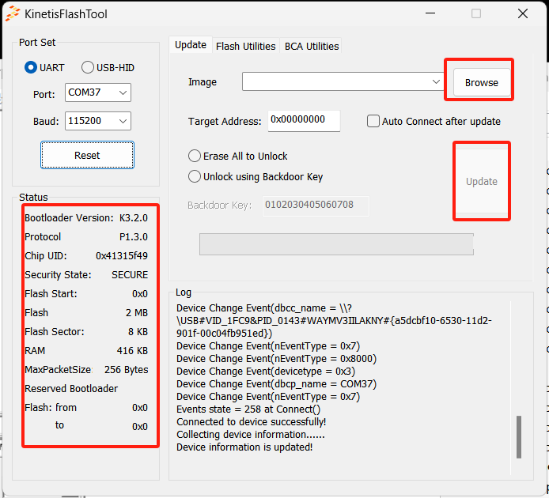

# NXP Application Code Hub
[](https://www.nxp.com)

## Simplified version of NXP official MCUBOOT
Simplified version of the official NXP [MCUBOOT](https://www.nxp.com/support/developer-resources/software-development-tools/mcuxpresso-software-and-tools/mcuboot-mcu-bootloader-for-nxp-microcontrollers:MCUBOOT). The majority of the features have been stripped away, retaining only the serial port download functionality. It can be used in conjunction with the official Windows command line tool `blhost` or the GUI tool `Kinetis Flash Tool` to achieve a bootloader based on the MCU serial port. This set of code is very easy to port to any MCU. It's suggested that the old-fashioned AN2295 no longer be recommended in the future, and migration to MCUBOOT should be unified. Given that the official MCUBOOT implementation is complex, this version was created.


#### Boards: Custom Board
#### Categories: Tools
#### Peripherals: FLASH
#### Toolchains: MDK

## Table of Contents
1. [Software](#step1)
2. [Hardware](#step2)
3. [Setup](#step3)
4. [Results](#step4)
5. [FAQs](#step5) 
6. [Support](#step6)
7. [Release Notes](#step7)

## 1. Software<a name="step1"></a>
- The basic implementation is completely decoupled from specific hardware. There are only 2 .c and .h files: kptl.c and mcuboot.c. Except for the Systick interrupt, no other interrupts are used. Only serial polling is used for sending and receiving data.
- All necessary hardware-related operations are explicitly managed through callback functions. kptl and mcuboot themselves have no hardware dependencies, making them very easy to port to any ARM Cortex MCU. kptl and mcuboot are written in a very beginner-friendly manner; anyone with a basic understanding of C can comprehend and easily modify them.
- blhost and Kinetis Flash Tool software can be download from [here.](https://www.nxp.com/design/software/development-software/mcuxpresso-software-and-tools-/mcu-bootloader-for-nxp-microcontrollers:MCUBOOT)

## 2. Hardware<a name="step2"></a>
| Supported hardware | APP start address |
| ------------------ | :---------------: |
| FRDM-K64           |      0x8000       |
| FRDM-KE02          |      0x8000       |
| FRDM-KE15          |      0x8000       |
| FRDM-KE04          |       0xC00       |
| FRDM-KE17          |      0x8000       |
| FRDM-KL26          |      0x8000       |
| TWR-KE18F          |      0x8000       |

## 3. Setup<a name="step3"></a>
Using FRDM-K64 as an example:

### 3.1 Step1 
Compile the **frdm_k64_bl** project and use JLINK to download it to the FRDM-K64 board.
### 3.2 Step2
Launch KinetisFlashTool.exe. Within 300ms after the MCU resets, click "connect". Once connected successfully, the host computer will display the MCU information.
### 3.3 Step3
Compile frdm_k64_example_app to obtain the frdm_k64_example_app.hex file. Select the hex file and click "UPDATE" to start the upgrade.


## 4. Results<a name="step4"></a>
In KinetisFlashTool, click connect and select the hex application file, click "UPDATE" to start the upgrade.



## 5. FAQs<a name="step5"></a>
1. The implementation of Flash operations is crucial. Generally, flash devices are block devices with a minimum erasure and programming unit (especially LPC, where the minimum erase and programming units are different and large, which is quite cumbersome). This requires special attention when implementing the `memory_write` function. Proper alignment is necessary. If the data doesn't meet the minimum programming unit, it needs to extract and merge the previous data. If the data exceeds the minimum programming unit, the flash_program function must be called multiple times to ensure everything is written.
2. For MCU reset implementation, you can directly call the CMSIS library function NVIC_SystemReset.
3. Before the final jump, you generally need to de-initialize all peripherals. Turn off all interrupts (including SysTick). These operations can be done in mcuboot_complete.
5. The final jump to the user app mainly requires three steps: resetting the PC, SP, and setting the interrupt vector table entry address: SCB->VTOR. The SP is bytes 0-3 of the Image, and PC is bytes 4-7. You can directly use the following traditional function:

```
void JumpToImage(uint32_t addr)
{
    static uint32_t sp, pc;
    uint32_t *vectorTable = (uint32_t*)addr;
    sp = vectorTable[0];
    pc = vectorTable[1];
    
    typedef void(*app_entry_t)(void);

    /* must be static, otherwise SP value will be lost */
    static app_entry_t s_application = 0;

    s_application = (app_entry_t)pc;

    // Change MSP and PSP
    __set_MSP(sp);
    __set_PSP(sp);
    
    SCB->VTOR = addr;
    
    // Jump to application
    s_application();

    // Should never reach here.
    __NOP();
}
```
6. Don't forget to modify the start address in the APP project.

7. Some development boards (like FRDM-KE02) have on-board openSDA K20 debuggers whose USB-to-serial port function is not well-implemented, failing to effectively recognize the PING start command, resulting in handshake failure. An update to the latest JLINK OPENSDA firmware is required for firmware download: https://www.segger.com/products/debug-probes/j-link/models/other-j-links/opensda-sda-v2/


## 6. Support<a name="step6"></a>


#### Project Metadata
<!----- Boards ----->


<!----- Categories ----->
[](https://github.com/search?q=org%3Anxp-appcodehub+tools+in%3Areadme&type=Repositories)

<!----- Peripherals ----->
[](https://github.com/search?q=org%3Anxp-appcodehub+flash+in%3Areadme&type=Repositories)

<!----- Toolchains ----->
[](https://github.com/search?q=org%3Anxp-appcodehub+mdk+in%3Areadme&type=Repositories)

Questions regarding the content/correctness of this example can be entered as Issues within this GitHub repository.

>**Warning**: For more general technical questions regarding NXP Microcontrollers and the difference in expected funcionality, enter your questions on the [NXP Community Forum](https://community.nxp.com/)

[](https://www.youtube.com/@NXP_Semiconductors)
[](https://www.linkedin.com/company/nxp-semiconductors)
[](https://www.facebook.com/nxpsemi/)
[](https://twitter.com/NXP)

## 7. Release Notes<a name="step7"></a>
| Version | Description / Update                           | Date                        |
|:-------:|------------------------------------------------|----------------------------:|
| 1.0     | Initial release on Application Code Hub        | October 8<sup>th</sup> 2023 |

